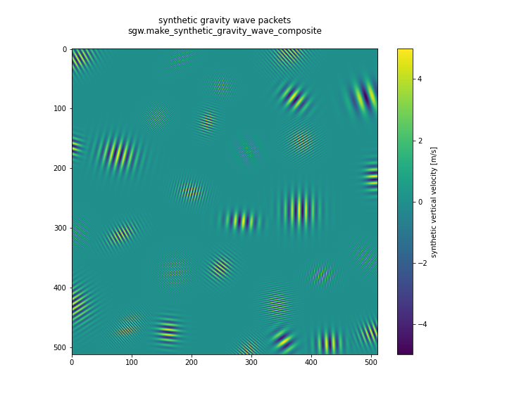
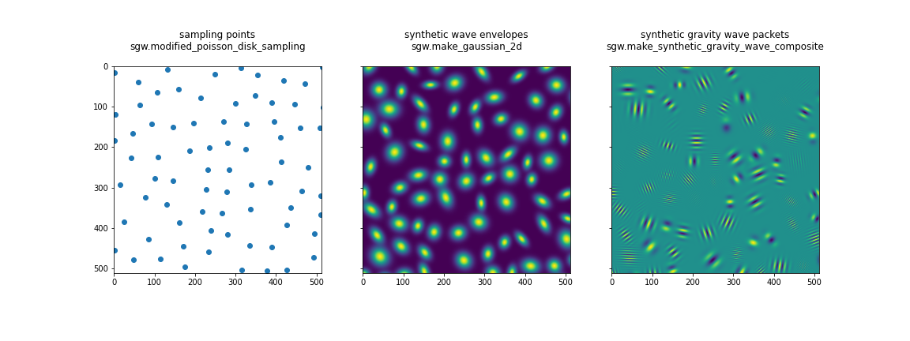

# Synthetic gravity waves

[](https://github.com/leifdenby/synthetic-gravity-waves/actions/workflows/python-package-pip.yml) [](https://zenodo.org/badge/latestdoi/594090735)


This python package facilitates the creation of 2D synthetic atmospheric
gravity-wave wave-packets mimicking the vertical velocity structure seen in numerical weather prediction models as fixed height or pressure levels.



## Installation and usage

Install the package with `pip` from [pypi.org](https://pypi.org)

```bash
python -m pip install synthetic_gravity_waves
```

And the import `synthetic_gravity_waves` and use it to create a uniformly gridded vertical velocity field with synthetic gravity wave wave-packets:

```python
import synthetic_gravity_waves as sgw

phi = sgw.make_synthetic_gravity_wave_composite(N=512, r_sigma=10.0, r0=80.0, lw0=10.0)

w0 = 5.0  # max characteristc vertical velocity [m/s]
w = phi * w0

# w now contains synthetic gravity wave packets with amplitude between -w0 and w0
```

## Method



The method uses a point-sampling method based on the
Poisson-disc sampling algorithm by [Robert
Bridson](http://www.cs.ubc.ca/~rbridson/docs/bridson-siggraph07-poissondisk.pdf),
but modified to in place of using a 2D density field to define the local
density of points the spatial separation between points is sampled from a
Gaussian distribution with mean `r0` and standard deviation `r_sigma`. The
sampling is done on a grid of shape `(N, N)`. At the sampled points 2D Gaussians envelopes modulating plane-parallel carrier waves with a controllable characterisc wavelength.

See [notebooks/usage.ipynb] for details.

# References

- [Fast Poisson disk sampling in arbitrary dimensions](https://dl.acm.org/doi/10.1145/1278780.1278807) , Bridson, R. (2007). Fast Poisson disk sampling in arbitrary dimensions. SIGGRAPH sketches, 10(1), 1. [PDF](https://www.cs.ubc.ca/~rbridson/docs/bridson-siggraph07-poissondisk.pdf)

- [poissonDiskSampling](https://gitlab.com/abittner/poissondisksampling) by Adrian Bittner.
